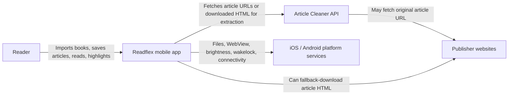
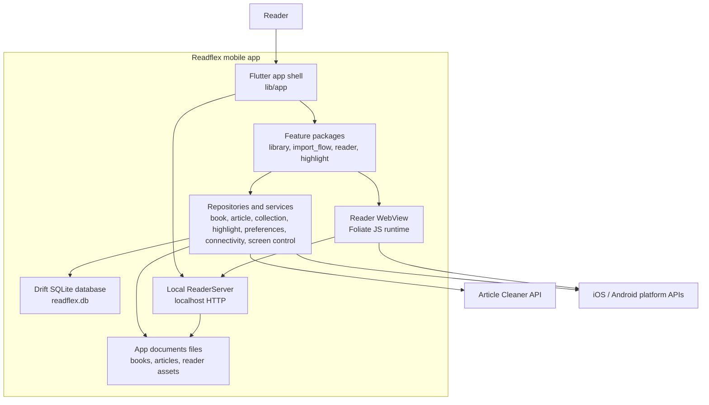
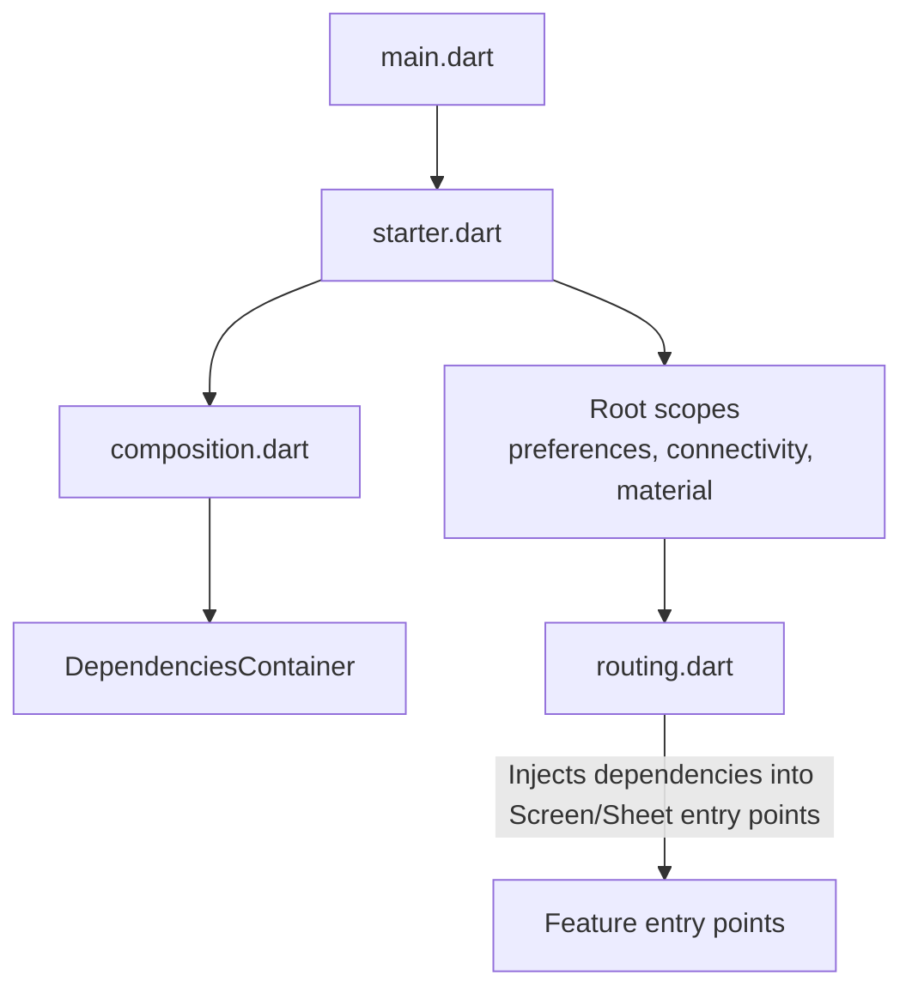
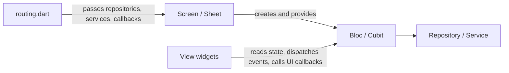
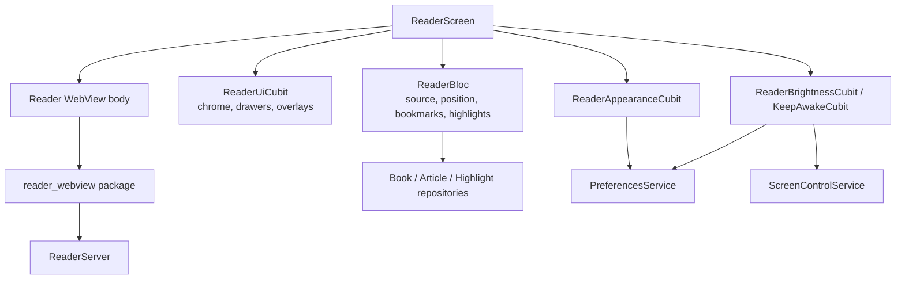
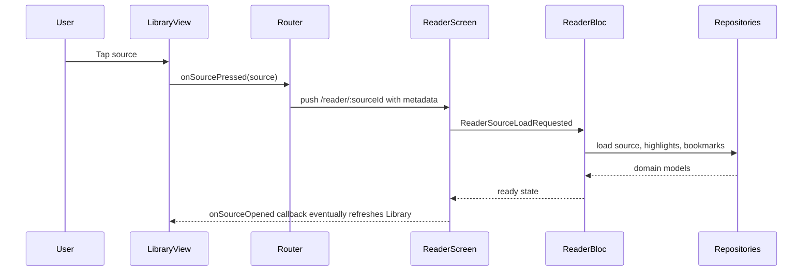
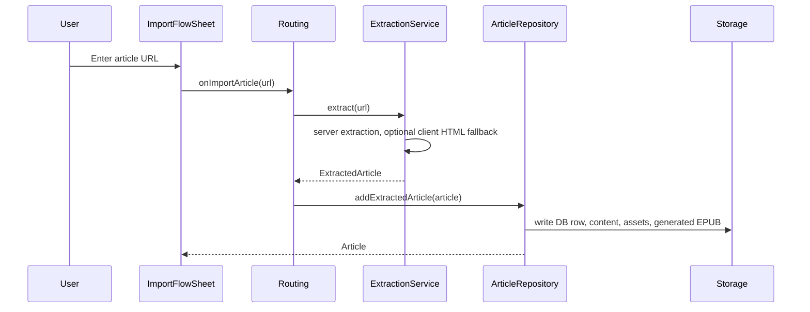
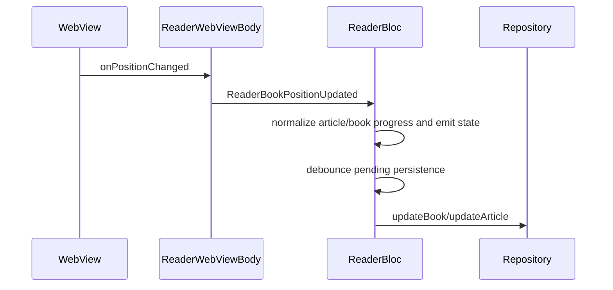

# Readflex C4 Model

This document describes the current Readflex architecture using the C4 model.
It complements `ARCHITECTURE.md`: that file defines package rules and
maintainer conventions, while this file shows the system from progressively
lower levels of abstraction.

The implementation is the source of truth. Update this model when package
boundaries, runtime containers, storage ownership, or integration points change.

## Level 1: System Context

Readflex is a mobile reading app for imported books, saved web articles, and
highlights. It runs on iOS and Android, stores user data locally, renders books
through a local WebView reader runtime, and optionally calls a remote article
cleaner backend to extract readable article content.

### External Systems

| System | Responsibility | Current integration |
|--------|----------------|---------------------|
| Article Cleaner API | Extracts readable article content from URLs or downloaded HTML. | `article_extraction_service` via HTTP. |
| Publisher websites | Original article pages and assets. | Article cleaner server fetches first; app can fallback-download HTML. |
| iOS / Android platform services | Files, WebView, brightness, wakelock, connectivity, package info. | Flutter plugins and local packages. |

## Level 2: Containers

Readflex is shipped as one Flutter mobile app, but internally it has clear
runtime containers: the Flutter UI/runtime, a local Drift database, app-owned
files, a local HTTP reader server, and a WebView-based Foliate reader.

### Container Responsibilities

| Container | Code location | Responsibility |
|-----------|---------------|----------------|
| Flutter app shell | `lib/app` | Bootstrap, dependency composition, scopes, GoRouter routes, app lifecycle, system UI mode. |
| Feature packages | `packages/features/*` | User-facing flows and feature state management. |
| Repositories/services | `packages/*_repository`, `packages/*_service`, specialized packages | Data source orchestration, platform/backend contracts, persistence boundaries. |
| Local database | `packages/local_storage` | Drift schema, DAOs, migrations, storage rows. |
| App files | App documents directory | Imported books, extracted article content, generated EPUBs, reader assets. |
| Local ReaderServer | `packages/reader_server` | Serves Foliate assets and source bytes to the WebView, including range requests. |
| Reader WebView | `packages/reader_webview` + `foliate-js` assets | Hosts Foliate, JS bridge, reader metadata/search/highlight callbacks. |

## Level 3: Components

### App Shell Components

| Component | Responsibility |
|-----------|----------------|
| `starter.dart` | Flutter binding, error zone, logging, bloc observer, tracing, asset extraction, reader server startup. |
| `composition.dart` | Creates database, repositories, services, document directories, and the reader server. |
| `dependency_container.dart` | Plain dependency holder plus best-effort dispose. |
| `root_context.dart` / `material_context.dart` | Root scopes, Material app, router, lifecycle handling. |
| `routing.dart` | Navigation table, entry redirects, feature wiring, app-level callbacks. |

### Feature Components

| Feature | Entry point | State owner | Main dependencies |
|---------|-------------|-------------|-------------------|
| Library | `LibraryScreen` | `LibraryBloc`, layout/theme/selection cubits | Book, article, collection repositories, preferences, toast wrapper. |
| Import Flow | `showImportFlowSheet` | `ImportFlowCubit` | File picker/import callbacks, article import callback, reader metadata extraction. |
| Reader | `ReaderScreen` | `ReaderBloc` plus reader UI cubits | Book/article/highlight repositories, preferences, reader WebView, screen control, text actions. |
| Highlight | `HighlightAction`, `HighlightSheet` | `HighlightCubit` | Highlight repository, shared text action contract. |

### Reader Components

Reader-specific split:

- `ReaderBloc` owns source loading, persisted position, bookmarks, TOC,
  highlights, and article/book persistence.
- `ReaderUiCubit` owns chrome, drawer, tap-zone, and transient UI overlays.
- `ReaderSearchCubit`, `ReaderSelectionCubit`, `ReaderImageSelectionCubit`,
  and `ReaderImageHighlightCubit` keep narrower UI/interaction concerns out of
  `ReaderBloc`.
- `reader_webview` owns the Foliate bridge, search calls, annotation rendering,
  and WebView callbacks.

## Level 4: Code-Level Slices

### Library Source Open Flow

### Article Import Flow

### Reader Position Persistence

## Architectural Invariants

- `routing.dart` is the composition root for feature navigation and external
  callbacks.
- Screen/Sheet entry points may receive repositories/services.
- View/private widgets should use Bloc/Cubit state, events, and UI callbacks,
  not repositories, services, DAOs, or backend clients.
- Feature packages must not import sibling feature packages.
- Domain models remain storage-agnostic and Flutter-agnostic.
- Storage rows and DAOs remain behind repositories.
- Reader text actions use `shared.TextAction`; the reader does not import the
  Highlight feature directly.
- Connectivity is a UI signal; services still attempt work and map failures.

## Known Production Gaps

- Error reporting and analytics are represented by no-op implementations.
- Translation, dictionary, flashcard, practice, profile, subscription, auth,
  AI, and notification surfaces are currently outside the active package graph.
- Dormant dictionary/flashcard/review storage models remain for migration
  compatibility and future restoration.
